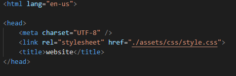
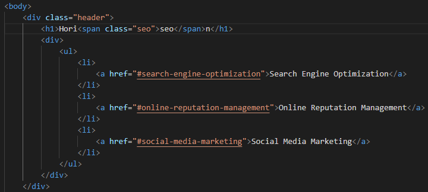
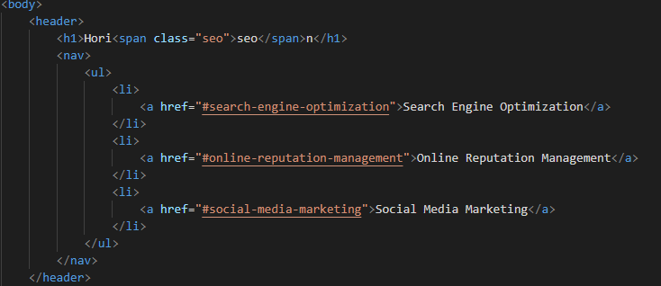
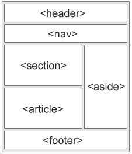

# Horiseon Refractor

## Description 

This activity is a chance to do some spring cleaning on someone else's already written code. My ultimate goal was to simplify the structure, use semantic html, and make sure everything functioned properly. I include various examples of work I did under usage. 

[Horiseon Refractor](https://dstefani86.github.io/horiseon-refractor/)

## Installation
To install this project, fork the repository to your Gtihub account. Once on your Github account you can >clone that sucker down>

## Usage 

I made a few changes to the sequential order to what seemed out of place to me.

Before:

After:

I turned the header into its own element tag. I was generally just trying to simplify the commands in Semantics to make the code easier to access with less class and div tags. 

Before:

After:

I also fixed an issue where the Search Engine Link was not going to coorect spot on the page so I added an id and class for their respective commands.

Ultimately, I tried to follow this diagram to the best of my ability

## Credits
[W3schools](www.w3schools.com)
 
The Studious Discord!!

## Contact Me!

[Email](stefanibusiness@gmail.com)
 
[LinkedIn](https://www.linkedin.com/in/daniel-stefani-b88695238/)

## License

MIT License

Copyright (c) [2022] [Daniel Stefani]

Permission is hereby granted, free of charge, to any person obtaining a copy
of this software and associated documentation files (the "Software"), to deal
in the Software without restriction, including without limitation the rights
to use, copy, modify, merge, publish, distribute, sublicense, and/or sell
copies of the Software, and to permit persons to whom the Software is
furnished to do so, subject to the following conditions:

The above copyright notice and this permission notice shall be included in all
copies or substantial portions of the Software.

THE SOFTWARE IS PROVIDED "AS IS", WITHOUT WARRANTY OF ANY KIND, EXPRESS OR
IMPLIED, INCLUDING BUT NOT LIMITED TO THE WARRANTIES OF MERCHANTABILITY,
FITNESS FOR A PARTICULAR PURPOSE AND NONINFRINGEMENT. IN NO EVENT SHALL THE
AUTHORS OR COPYRIGHT HOLDERS BE LIABLE FOR ANY CLAIM, DAMAGES OR OTHER
LIABILITY, WHETHER IN AN ACTION OF CONTRACT, TORT OR OTHERWISE, ARISING FROM,
OUT OF OR IN CONNECTION WITH THE SOFTWARE OR THE USE OR OTHER DEALINGS IN THE
SOFTWARE.