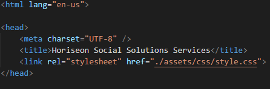

#Horiseon Refractor

## Description 


#

## Description 


The quality of a README often differentiates a good project from a bad project. A good one takes advantage of the opportunity to explain and showcase what your application does, justify the technologies used, and even talk about some of the challenges you faced and features you hope to implement in the future. A good README helps you stand out among the large crowd of developers putting their work on GitHub.

There's no one right way to structure a good README. There is one very wrong way, however, and that is to not include a README at all or to create a very anemic one. This guide outlines a few best practices. As you progress in your career, you will develop your own ideas about what makes a good README.

At a minimum, your project README needs a title and a short description explaining the what, why, and how. What was your motivation? Why did you build this project? (Note: The answer is not "Because it was a homework assignment.") What problem does it solve? What did you learn? What makes your project stand out? 

[Horiseon Refractor](https://dstefani86.github.io/horiseon-refractor/)

If you're new to Markdown, read the GitHub guide on [Mastering Markdown](https://guides.github.com/features/mastering-markdown/).

If you need an example of a good README, check out [the VSCode repository](https://github.com/microsoft/vscode).


## Installation
To install this project, fork the repository to your Gtihub account. Once on your Github account you can >clone that sucker down>

## Usage 

Provide instructions and examples for use. Include screenshots as needed. 

To add a screenshot, create an `assets/images` folder in your repository and upload your screenshot to it. Then, using the relative filepath, add it to your README using the following syntax:

```md

```


## Credits


## License

The last section of a good README is a license. This lets other developers know what they can and cannot do with your project. If you need help choosing a license, use [https://choosealicense.com/](https://choosealicense.com/)


## Contributing

If you created an application or package and would like other developers to contribute it, you will want to add guidelines for how to do so. The [Contributor Covenant](https://www.contributor-covenant.org/) is an industry standard, but you can always write your own.